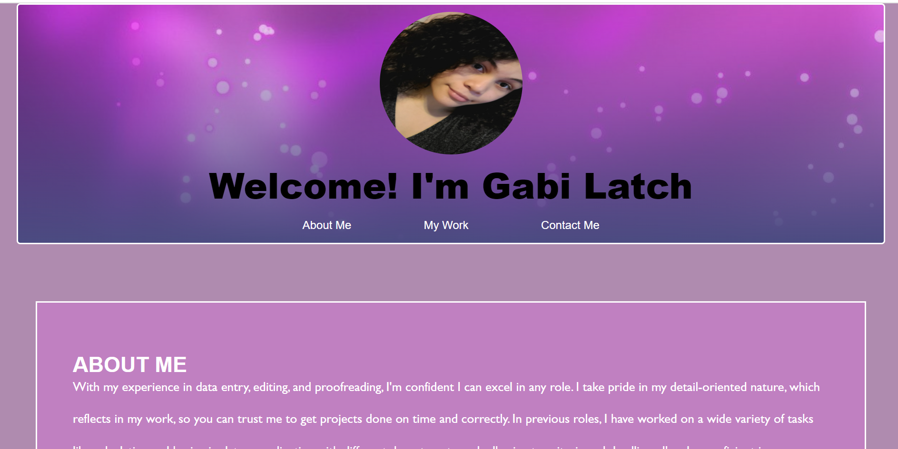

# Gabi-Latch-Portfolio
The purpose of this repo is to store code for and deploy my professional portfolio.
# Horiseon-Refactor-Module-1

## Description
After going to the URL, a user will see the navigation (nav) bar with a purple sparkle background surrounded by a white border at the top of the page. Inside the nave are a circular picture of myself, a greeting in bold black lettering, and 3 tabs in white leading to the "About Me," "My Work," and "Contact Me," respectively. The background is a muted purple or mauve color. Below the nav and header are the 3 sections connected to the previously mentioned tabs. The About Me section details my professional history; the My Work section portrays 3 images with links leading to 3 completed projects of mine; the Contact Me section has links for my phone number, email, Github, and resume. The first 2 sections are grape purple and the last section is a royal purple. 

## Details
The second module of the boot camp is to create a professional portfolio. The below bullets detail what was done to achieve this: 
- created the HTML structure and assigned primarily element names; 
- created CSS structure and assigned properties to elements; 
- images with links were added to the work section and alt text was added to each image; 
- comments were added to the CSS to better keep track of contents.

## Installation
N/A

## Usage
Users can utilize this source to check out the projects and professional history of myself, as well as contact me.

## Credits
N/A

## Acknowledgements
N/A

[The Professional Life of Gabi L]() 

